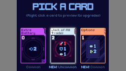
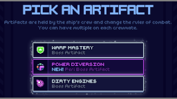
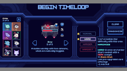

# Codex Helper

Displays a "NEW!" indicator next to cards and artifacts you've never picked (which are missing from the Codex). Additionally, displays stars next to difficulties you've beaten (with the chosen crew) in the new run menu.

## See also
* [Latest release](https://github.com/Shockah/Cobalt-Core-Mods/releases/tag/release%2Fcodex-helper-1.1.2)
* [Release notes](release-notes.md)