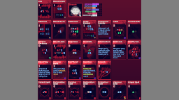
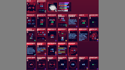
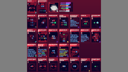

# Dracula

**THE MOD REQUIRES [Kokoro](https://github.com/Shockah/Cobalt-Core-Mods/blob/master/Kokoro).**

**Dracula** -- A so-called "last living human". His cards often *self-hurt*, but they also often *heal*.

Core mechanics:
*  **Self-hurt**: Dracula's cards often deal damage to his own ship, in return for powerful effects or lower than usual energy costs.
*  **Healing**: To combat the damage he's dealing to himself, a lot of Dracula's cards also have healing effects.
*  **Bleeding**: A common status effect which deals 1 damage each turn, targetting shields first, and decreases by 1.
*  **Transfusion**: An uncommon status effect, which is essentially a delayed heal, that can be negated by taking hull damage.
*  **Blood Mirror**: An uncommon status effect, which mirrors all hull damage you take onto the enemy.
*  **Bats**: An uncommon midrow familiar! Applies *Bleeding* to the enemy and *Transfusion* to you, but beware! The bats are very hungry, and if they cannot take a bite on the enemy, they WILL bite YOU instead!

Dracula also comes with his own ride -- the **Batmobile**. The Batmobile is an average 5-wide ship, which starts in a pretty weak state, but the lower its hull, the more benefits it gets. It also starts with a basic healing card, and an artifact which lets you heal even more hull, or store some hull for later.

Code and Design by Shockah  
Art by Arin

## See also
* [Latest release](https://github.com/Shockah/Cobalt-Core-Mods/releases/tag/release%2Fdracula-1.0.4)
* [NexusMods](https://www.nexusmods.com/cobaltcore/mods/12)
* [Release notes](release-notes.md)