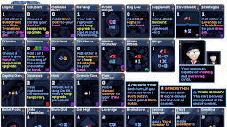
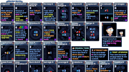
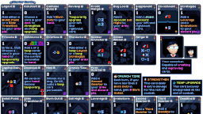

# Johnson

**THE MOD REQUIRES [Kokoro](https://github.com/Shockah/Cobalt-Core-Mods/blob/master/Kokoro).**

**Johnson** -- Your coworker. Capable of *creating* and *improving* cards.

Core mechanics:
*  **Temporary**: Johnson has several ways of creating temporary cards which you can choose, depending on your current situation.
*  **Temporary Upgrades**: The main way Johnson improves cards. These upgrades only last until the end of combat.
*  **Strengthen**: The second way Johnson improves cards. Strengthening cards increases their attack damage.

Code by Shockah  
Art and Design by Soggoru Waffle

## See also
* [NexusMods](https://www.nexusmods.com/cobaltcore/mods/10)
* [Release notes](release-notes.md)