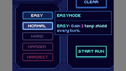
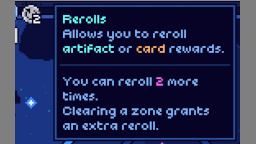
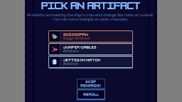
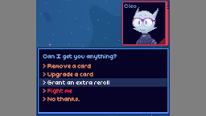

# Shockah's Cobalt Core mods

This is a list of all Cobalt Core mods I made. Issues or ideas can be reported via [the GitHub issues page](https://github.com/Shockah/Cobalt-Core-Mods/issues), or via Discord (you can find me on the official Cobalt Core server in the `#cobalt-modding` channel, as well as the mod-specific threads in the `#cc-mod-showcase` forum; my tag is `@shockah`).

# Codex Helper

Displays a "NEW!" indicator next to cards and artifacts you've never picked (which are missing from the Codex). Additionally, displays stars next to difficulties you've beaten (with the chosen crew) in the new run menu.  
\[[latest release](https://github.com/Shockah/Cobalt-Core-Mods/releases/tag/release%2Fcodex-helper-1.1.2)] \[[release notes](CodexHelper/docs/release-notes.md)] \[[README/source code](CodexHelper)]

# Crew Selection Helper

Improves the user experience while having installed multiple new character mods.  
\[[latest release](https://github.com/Shockah/Cobalt-Core-Mods/releases/tag/release%2Fcrew-selection-helper-1.0.0)] \[[release notes](CrewSelectionHelper/docs/release-notes.md)] \[[README/source code](CrewSelectionHelper)]

# Custom Difficulties

Introduces new difficulty levels to the game.  
\[[latest release](https://github.com/Shockah/Cobalt-Core-Mods/releases/tag/release%2Fcustom-difficulties-1.0.0)] \[[release notes](CustomDifficulties/docs/release-notes.md)] \[[README/source code](CustomDifficulties)]

# Rerolls

Adds a way to reroll artifact and card rewards.  
\[[latest release](https://github.com/Shockah/Cobalt-Core-Mods/releases/tag/release%2Frerolls-1.0.0)] \[[release notes](Rerolls/docs/release-notes.md)] \[[README/source code](Rerolls)]

