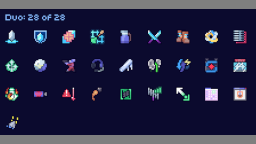
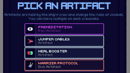
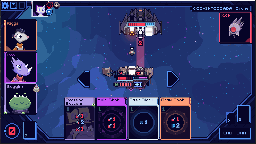
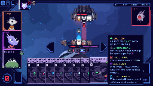
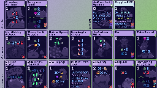
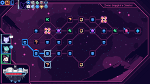

# Shockah's Cobalt Core mods

This is a list of all Cobalt Core mods I made. Issues or ideas can be reported via [the GitHub issues page](https://github.com/Shockah/Cobalt-Core-Mods/issues), or via Discord (you can find me on the official Cobalt Core server in the `#cobalt-modding` channel, as well as the mod-specific threads in the `#cc-mod-showcase` forum; my tag is `@shockah`).

# Codex Helper

Displays a "NEW!" indicator next to cards and artifacts you've never picked (which are missing from the Codex). Additionally, displays stars next to difficulties you've beaten (with the chosen crew) in the new run menu.  
\[[latest release](https://github.com/Shockah/Cobalt-Core-Mods/releases/tag/release%2Fcodex-helper-1.1.2)] \[[release notes](CodexHelper/docs/release-notes.md)] \[[README/source code](CodexHelper)]

# Crew Selection Helper

Improves the user experience while having installed multiple new character mods.  
\[[latest release](https://github.com/Shockah/Cobalt-Core-Mods/releases/tag/release%2Fcrew-selection-helper-1.0.0)] \[[release notes](CrewSelectionHelper/docs/release-notes.md)] \[[README/source code](CrewSelectionHelper)]

# Duo Artifacts

The mod adds a new artifact pool: duo artifacts, which are pretty powerful artifacts, synergizing between two different crew members.  
\[[latest release](https://github.com/Shockah/Cobalt-Core-Mods/releases/tag/release%2Fduo-artifacts-1.0.2)] \[[release notes](DuoArtifacts/docs/release-notes.md)] \[[README/source code](DuoArtifacts)]

# Kokoro

Kokoro is a utility/library mod - a little bit for players, and a lot for modders.  
\[[latest release](https://github.com/Shockah/Cobalt-Core-Mods/releases/tag/release%2Fkokoro-1.2.0)] \[[release notes](Kokoro/docs/release-notes.md)] \[[README/source code](Kokoro)]

# Rerolls

Adds a way to reroll artifact and card rewards.  
\[[latest release](https://github.com/Shockah/Cobalt-Core-Mods/releases/tag/release%2Frerolls-1.0.2)] \[[release notes](Rerolls/docs/release-notes.md)] \[[README/source code](Rerolls)]

# Soggins

**Soggins** -- Unavoidable bumbling idiocy.  
A completely disruptive crewmate, he makes most cards completely unreliable by just being aboard your ship, any single card played could turn out to work in unintended (but fun!) ways.  
\[[latest release](https://github.com/Shockah/Cobalt-Core-Mods/releases/tag/release%2Fsoggins-1.2.1)] \[[release notes](Soggins/docs/release-notes.md)] \[[README/source code](Soggins)]

# Wormholes

Is that... a wormhole? Adds a pair of wormholes on each map, which lets you traverse forward or backward, with some down/upsides.  
\[[latest release](https://github.com/Shockah/Cobalt-Core-Mods/releases/tag/release%2Fwormholes-1.0.0)] \[[release notes](Wormholes/docs/release-notes.md)] \[[README/source code](Wormholes)]

