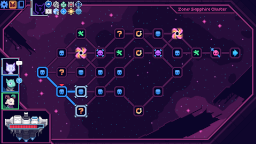

# Wormholes

Is that... a wormhole? Adds a pair of wormholes on each map, which lets you traverse forward or backward, with some down/upsides.

Both ways of travel give you a downside of your choice (+1 Debris card / -hull / -max shield).
Traveling forward also gives you an upside of your choice (one of the choices available when starting a run).
Revisited map nodes are empty - they have no enemies, rewards or events.

## See also
* [Latest release](https://github.com/Shockah/Cobalt-Core-Mods/releases/tag/release%2Fwormholes-1.0.0)
* [Release notes](release-notes.md)